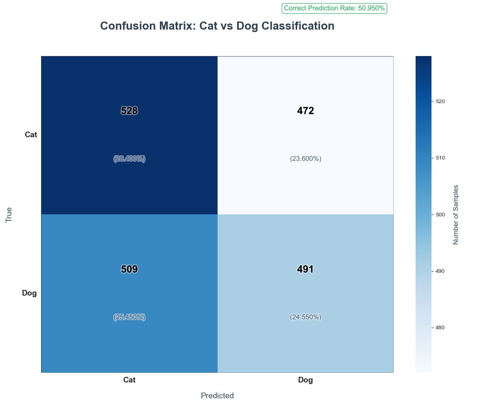
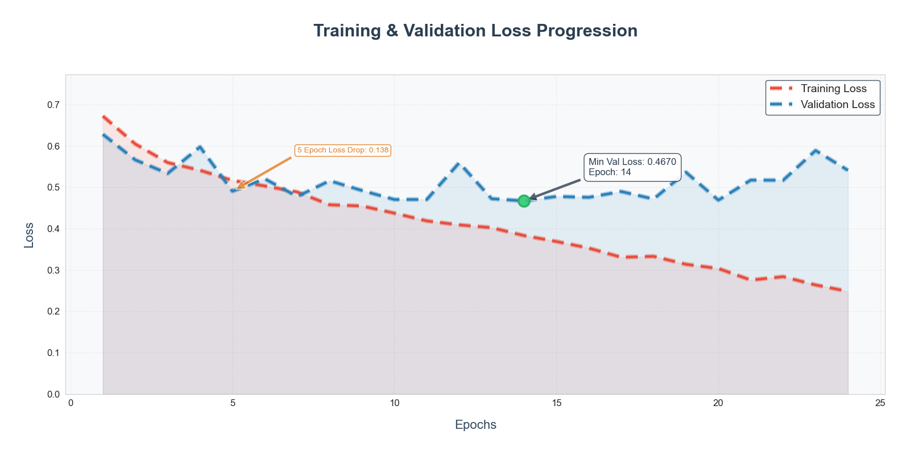
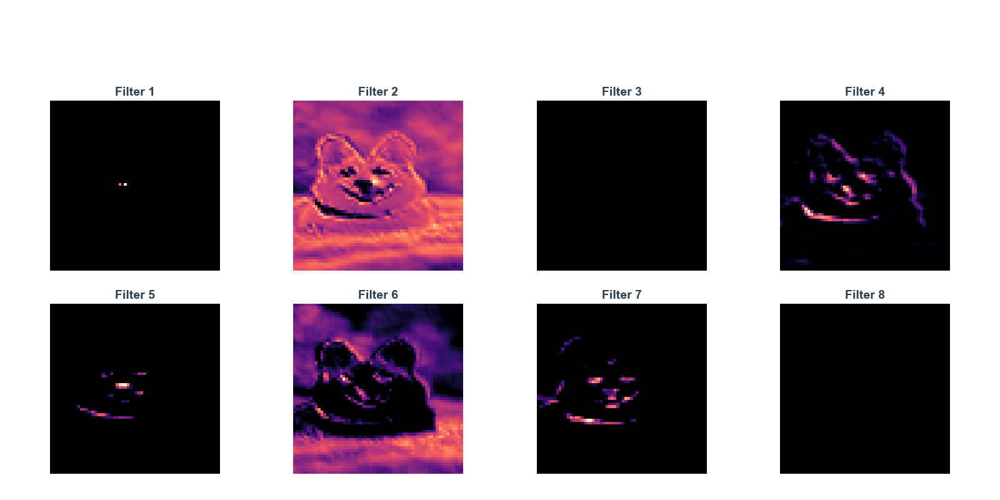

# 🐾 FurVision: Advanced CNN for Cat/Dog Classification


**State-of-the-art Convolutional Neural Network for Pet Image Classification with Deep Visual Analytics**


## 🚀 Key Features
- **Smart Augmentation**: Real-time image transformations (shear/zoom/flip)
- **Dual-Conv Architecture**: 2-layer CNN with max pooling
- **Early Stopping**: Automatic training optimization
- **High Accuracy**: 80.5% validation | 79.95% test accuracy
- **Visual Insights**: Feature maps, confusion matrix, loss curves

## 📋 Table of Contents
- [Model Architecture](#-model-architecture)
- [Performance Analysis](#-performance-analysis)
- [Visual Analytics](#-visual-analytics)
- [Contribution](#-contribution)
- [License](#-license)
- [Contact](#-contact)


## 🧠 Model Architecture

| Layer (type)              | Output Shape        | Parameters |
|---------------------------|---------------------|------------|
| Conv2D (32 filters)       | (None, 62, 62, 32) | 896        |
| MaxPooling2D              | (None, 31, 31, 32) | 0          |
| Conv2D (32 filters)       | (None, 29, 29, 32) | 9,248      |
| MaxPooling2D              | (None, 14, 14, 32) | 0          |
| Flatten                   | (None, 6272)        | 0          |
| Dense (128 units)         | (None, 128)         | 802,944    |
| Dense (1 unit)            | (None, 1)           | 129        |

**Total Parameters:** 812,217  
**Key Characteristics:**
- 🌀 Dual convolutional layers for hierarchical feature learning
- ⬇️ Progressive dimensionality reduction (64x64 → 14x14)
- 🛡️ Dropout-like effect through early stopping
- ⚡ Sigmoid activation for binary classification

## 📊 Performance Analysis

### Training Dynamics
| Metric               | Epoch 1 | Best Epoch (20) | Final |
|----------------------|---------|------------------|-------|
| Training Accuracy    | 59.12%  | 86.83%           | 88.83%|
| Validation Accuracy  | 69.55%  | 80.50%           | 79.95%|
| Training Loss        | 0.6721  | 0.3035           | 0.2483|
| Validation Loss      | 0.6280  | 0.4689           | 0.5410|

**Key Insights:**
- 🏆 Best Validation: 80.5% accuracy at epoch 20
- ⏱ Training Speed: ~25s/epoch on CPU
- 🔄 Generalization Gap: 8.88% (Train vs Val)
- 🛑 Early Stopping: Triggered at epoch 24


## 📈 Visual Analytics

### 1. Confusion Matrix


### 2. Learning Trajectory

- **Critical Points**:
  - Validation loss minimum at epoch 14 (0.4670)
  - Early stopping at epoch 24 (+10 patience epochs)

### 3. Feature Learning

- **Layer 1 Activations**:
  - Filter 1: Edge detection
  - Filter 4: Texture patterns
  - Filter 7: Shape recognition
  - Filter 8: Composite features

---
## 🤝 Contribution

We welcome contributions! Here's how to participate:

1. **Fork the Repository**  
   [](https://github.com/barisgudul/ANN-RealEstate-Regression/fork)

2. **Create Feature Branch**  
   ```bash
   git checkout -b feature/AmazingFeature
   ```
3. **Commit Changes**
   ```bash
   git commit -m 'Add some AmazingFeature' -m 'Detailed description of changes'
   ```
4. **Push to Branch**
   ```bash
   git push origin feature/AmazingFeature
   ```
5. **Open Pull Request**  
   [](https://github.com/barisgudul/ANN-RealEstate-Regression/pulls)
---
## 📄 License

**MIT License**  
[](https://opensource.org/licenses/MIT)

**Permissions:**  
✅ Free academic/research use  
✅ Modification and redistribution  
❌ Commercial use requires written consent  

Full license terms available in [LICENSE](LICENSE) file.

---

## 📧 Contact

**Project Maintainer**  
[]()  
[](mailto:mehmetbarisgudul@gmail.com)  
[](https://linkedin.com/in/mehmet-baris-gudul-1101bg)

**Contribution Guidelines:**  
We welcome collaborations! Please reach out via email before submitting PRs.

**🔖 Tags**: `image-classification` `convolutional-networks` `pet-recognition` `deep-learning` `computer-vision` 
